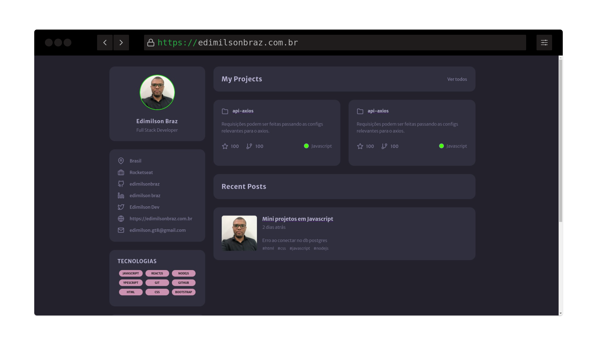

<h1 align="center">
  

      
  

  <h2>PORTFOLIO</h2> 
  
Esta aplicaçao foi desenvolvida por mim para validar meus conhecimentos em HTML5 E CSS3

  
</h1>

## TECNOLOGIAS
- ⚛️ [HTML5](https://developer.mozilla.org/pt-BR/docs/Web/HTML)
- ⚛️ [CSS3](https://developer.mozilla.org/pt-BR/docs/Web/CSS)

 

## License
[**Edimilson Braz**](https://www.linkedin.com/in/edimilsonbraz/)

  

